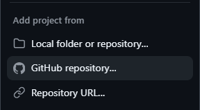
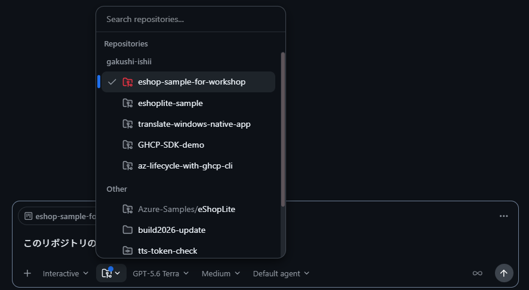
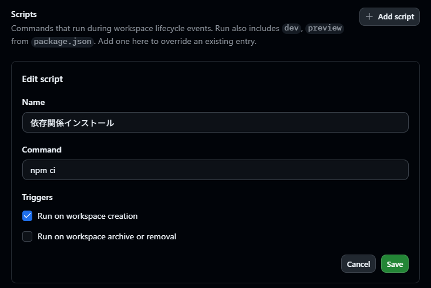
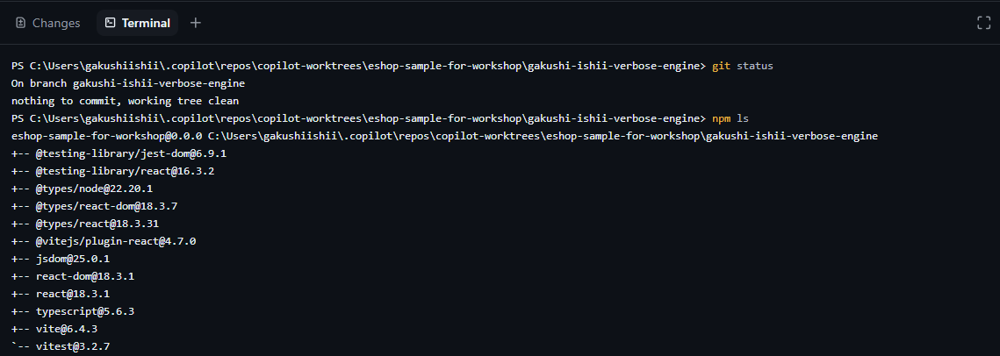
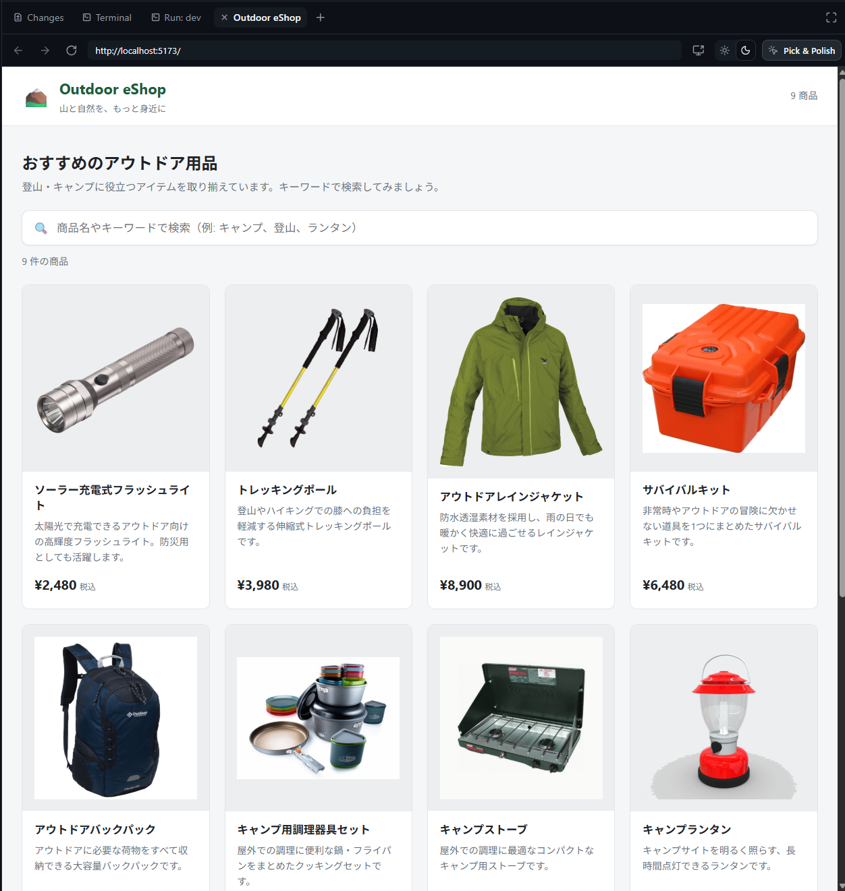

# Lab 00: GitHub Copilot App の基本的な使い方を学ぶ

**テーマ:** GitHub Copilot App のセットアップと Preflight

## 前提条件

- GitHub Copilot App が利用できること。

    参照：[GitHub Copilot アプリを使い始める](https://docs.github.com/ja/copilot/how-tos/github-copilot-app/getting-started)
- Node.js 20 と npm が利用できること。

## 手順

### 1. Fork したリポジトリをプロジェクトに追加する

サイドバーの「Sessions」>「＋」ボタンから **Add project from > GitHub repository...** を選び、Fork した Outdoor eShop リポジトリを追加する。



### 2. Quick Chat を試す

リポジトリに接続が出来たら、サイドバーの「Chats」から New Chat を開きます。リポジトリアイコン (Mode の右) から、先程追加したリポジトリを選択し、以下プロンプトを実行する。

```text
このリポジトリの概要を教えて
```



> [!TIP]
> Chats はブランチやワークツリーを作成することなく、質問やブレーンストーミングを行うことが可能。

### 3. Shell コマンドを実行し、npm レジストリへの疎通を確認する。

プロジェクトから新しいセッションを作成し、**Local repository** を選ぶ。※Local repository は手順 1 でクローンしたリポジトリ上で動作する。

立ち上がったセッションの入力欄で、`!` に続けて 以下 shell コマンドを実行し、npm レジストリへの疎通を確認する。

```shell
npm view react-router-dom version engines peerDependencies --json
```

以下のような json が返却されたら OK

```
{
  "version": "7.18.1",
  "engines": {
    "node": ">=20.0.0"
  },
  "peerDependencies": {
    "react": ">=18",
    "react-dom": ">=18"
  }
}
```

> [!IMPORTANT]
> このリポジトリはプロジェクトの `.npmrc` でレジストリを固定していない。
> 公開 npm レジストリへ直接アクセスできない環境では、所属組織が指定するレジストリをユーザーまたはマシン単位で設定してから npm のコマンドを再実行する。
> 組織固有のレジストリ URL や認証情報は、リポジトリの `.npmrc` に追加しないこと。

### 4. Setup スクリプトに `npm ci` を設定する

追加したリポジトリを右クリック → **Settings** → **Scripts** で、Setup スクリプトを開き、次を設定して **Save** する。

- **Name**: `依存関係インストール`
- **Command**: `npm ci`
- **Triggers**: **Run on workspace creation** をオン



この設定をしておくと、新しいワークスペース作成時に `package-lock.json` どおりの依存がインストールされる。

### 5. 新しいワークツリーを作成し、自動でパッケージがインストールされたことを確認する。

プロジェクトから新しいセッションを作成し、**New worktree** を選ぶ。プロンプトを実行して初めて新しいワークスペースが作成されるため、以下 Shell コマンドを実行する。

```shell
git branch
```

1, 2分ほど時間を置いたらターミナルで `npm ls` を実行し、パッケージがインストールされていることを確認する。



> [!TIP]
> - ワークツリーのメリットを享受できる。
> - Setup スクリプトで初回に毎度 `npm ci` が実行されるため、すべてのワークツリーで `package-lock.json` に準拠した依存関係バージョンが使用できる。

### 6. Run と Canvas を確認する

右上の **Run** でアプリを起動し、**Browser Canvas** で商品一覧が表示されることを確認する。



## 期待する結果 / 残る成果物

- Fork したリポジトリがプロジェクトに追加されている。
- Setup スクリプトで依存がインストールされている。
- New worktree のセッションが作成され、起動している。
- セッション上の shell コマンドで worktree の状態と npm レジストリへの疎通が確認できている。
- Run でアプリが起動し、Canvas で表示できる。

> うまくいかない場合は [講師ガイド](./instructor-guide.md#lab-00-復旧) を参照。

---

次へ → [Lab 01: 機能実装でガードレールを体験する](./01-implement-with-guardrails.md)
