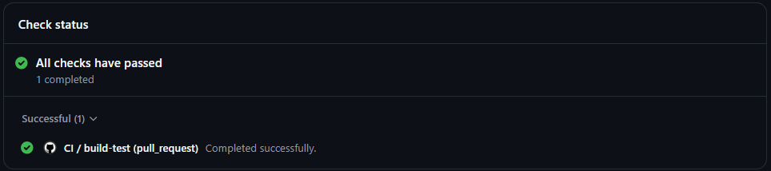
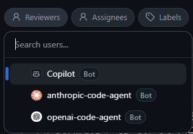
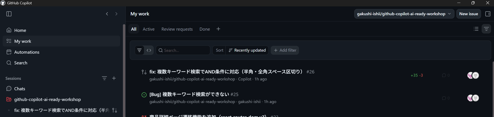

# Lab 02: PR 作成、レビューを加速する

**テーマ:** main へのマージに機械的な品質ゲートと人の確認フローを組みこむ。

## シナリオ

- GitHub Copilot App では PR の自動作成や Auto マージが可能だが、認識負債・齟齬を考慮して、本ラボではこれらを実施しない。
- エージェントにはドラフト案だけを作成させ、PR タイトル・本文を人が確認する手順を踏む。
- 依存ガードレールやテスト、型チェック・ビルド検証といったゲートを、サーバー側の CI に組み込むことで、機械的に品質を担保する。

## 前提条件

- Lab 01 の実装・検証・Browser Canvas での動作確認が完了していること。
- GitHub Actions が利用できる。
  1. Web UI (github.com) でフォークしたリポジトリを開き、**[Actions]** タブを開く。
  2. **[I understand my workflows, go ahead and enable them]** を押す。
   

## 手順

### 1. Create draft PR でタイトルと本文を確認する

Lab 02 で使用したセッションから **[Create draft PR]** を実行する。Lab 01 でコミットをしてなければコミットされ、変更内容に関する PR ドラフトが自動生成される。

> [!Tip]
> - **Agent merge**：PR 作成からマージまで全自動でエージェントが代行。
> - **Create PR**：レビュー可能な PR を作成。
> - **Create draft PR**：PR ドラフトで作成。本ラボではこれを扱う。

参考：[GitHub Copilot アプリを使用した問題と pull request の管理](https://docs.github.com/ja/copilot/how-tos/github-copilot-app/managing-issues-and-pull-requests)

Draft PR が作成されたら、右のサイドバーに **PR** タブ表示される。**PR** タブを開き、ドラフト内容を確認する。

- base ブランチが `main` であることを確認する。
- タイトルが本実装とマッチしているか、本文に背景や変更内容、検証内容が含まれているか確認する。
- CI が自動で走り、ワークフローが正常に完了しているかを確認する。
- コンフリクトが発生していないか確認する。

### 2. Cloud Agent (クラウドで稼働する Copilot) にレビューを依頼する

PR の内容を確認したら、右上の **Draft** を押し、**[Ready for review]** で PR を Open にする。
※ **[Agent merge]** は今回 OFF

Copilot Review を試すため、現在開かれている **Merge pull request** ページは一度閉じ、再度 PR タブを開く。
**Reviewers** から Copilot をアサインする。

> [!WARNING]
> **Reviewer のアップデートに失敗した場合は Web UI (github.com) から PR を開き、右側サイドバーの Reviewers から Copilot に Request する**

Copilot がコードレビューを開始すると、**[View session]** が表示される。**[View session]** では Cloud Agent が実際にレビューしているセッションを確認できる。

レビュー結果には PR の概要と変更箇所、レビューしたファイル一覧が含まれる。レビューによる変更提案に関しては以降の Lab に影響がないため、全て承認して先に進めてよい。

> [!Note]
> 変更提案を承認すると、再度 CI が発火し、品質チェックを行う。

### 3. main へマージする

右上の **Ready to merge** からサイドバーを開き、**Merge Commit** で PR を Main ブランチへマージする。

## Optional : GitHub Copilot App で PR 管理

GitHub Copilot App の左サイドバーから **[My work]** を開くと、対象リポジトリの PR 一覧やレビュー依頼が確認できる。

ログインアカウントに紐づくリポジトリの PR 状況が全て確認できるため、複数プロジェクトを横断した進行管理やレビュー実施が可能。

※ 右上の **[All repositories]** からリポジトリをフィルターできる。

## 本ラボで期待する結果

- 実装内容や背景をくみ取った PR が作成される。
- PR テンプレートに沿った形式で PR を作成される。
- クラウド上で Copilot にレビューが走る。
- サーバー側の CI が走り、品質チェックを行う。

> [!IMPORTANT]
> 計画・実装の流れのまま Pull Request を作成・確認でき、レビュー・マージを GitHub Copilot App で完結できる。

---

← [Lab 01](./01-implement-with-guardrails.md) ・ 次へ → [Lab 03: 運用バグを Cloud Agent へ委託する](./03-delegate-bug-to-cloud-agent.md)
