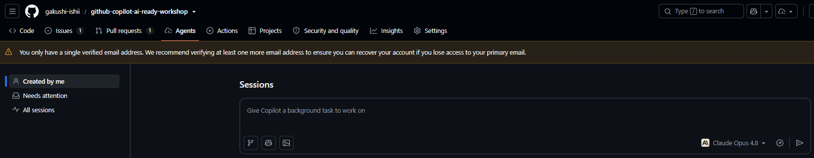
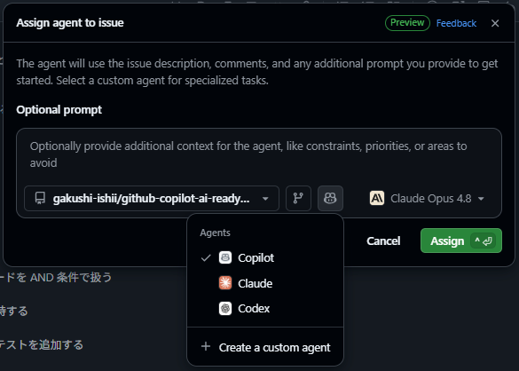
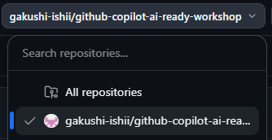
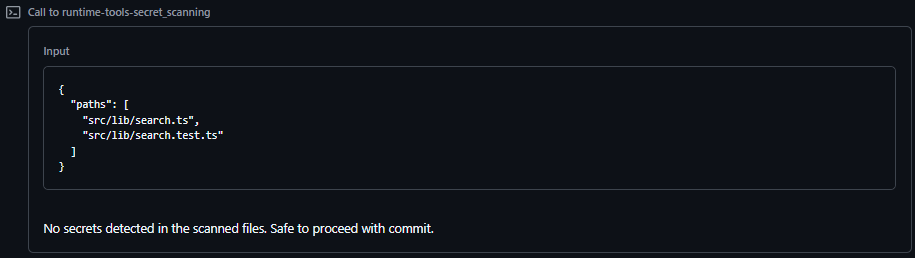
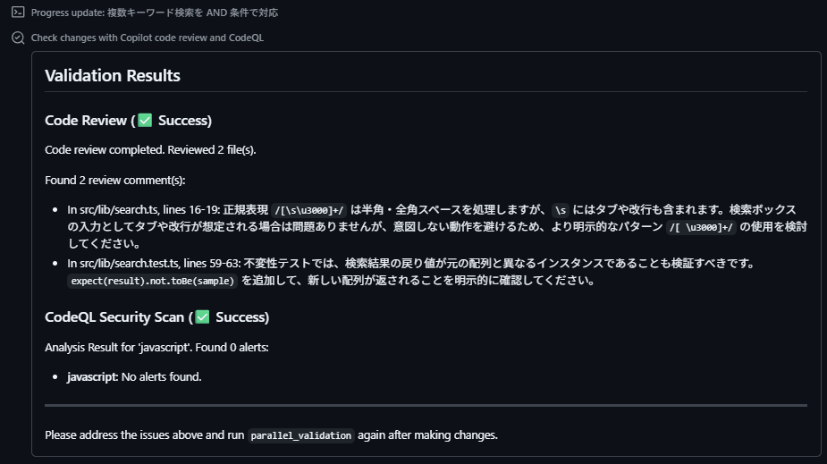
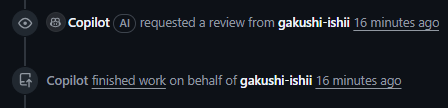

# Lab 03: 運用バグを Cloud Agent へ委託する

**テーマ:** 運用チームから上がった Issue を、Cloud Agent に修正を委託する

## シナリオ

リリース後、利用者から「複数キーワードで検索すると 0 件になる」という報告が届いた。
`キャンプ テント` のようにスペース区切りで検索すると、商品名に両方の語が含まれていてもヒットしない。このバグに関して Issue を立ち上げ、Cloud Agent へ委託する。

これまでの Lab では GitHub Copilot App (ローカル) で GitHub Native なローカルエージェントの活用を体験したが、本ラボでは Issue 起点でのバグ修正を Cloud Agent に委任する流れを体験する。

## 前提条件

- Lab 02 で `main` に変更がマージされていること。
- フォークリポジトリに Issues 機能が追加されていること。
  1. フォークしたリポジトリで **[Setting]** を開く。
  2. [Features] の **Issues** チェックボックスから有効にする。

## 手順

### 1. ローカル main に前回の変更を反映させる・バグを確認する

1. GitHub Copilot App で該当プロジェクトから **[New Session]** を開き、**Local repository** を選択して、`git status` を実行する。
2. 先程 Lab 02 で PR 経由でマージした変更をローカルの main に反映させるために、右上の **Pull** を押す。
3. **Run** を実行してアプリケーションを起動し、**Browser Canvas** で商品詳細ページが機能が反映されているか確認する。
4. **バグの確認** : 検索ボックスに `キャンプ テント`（半角スペース）と入力し、0 件になることを確認する。


### 2. Issue を作成する

Lab 02 ではレビューのみ Cloud Agent へ委任したが、今回は実装からテスト・PR 作成まで Cloud Agent に委任する。

Cloud Agent は **[Agents]** タブの **Sessions** から依頼をすれば、依頼の完了から PR 作成まで一気通貫で行う。



今回は実際の実務を想定して Agents Session は使わず、 **Issue** を立ち上げ Cloud Agent にアサインする形でタスクを委任する。

#### Web UI 経由と GitHub Copilot App 経由の考慮事項

Issue の作成も GitHub Copilot App から行うことが可能だが、現時点では Issue テンプレートや Cloud Agent のモデル指定が出来ないため、本手順では二通りのパターンを示す。

Cloud Agent をモデル指定 (preview) し、高性能で実行させたい人は **a** を、
GitHub Copilot App UI で全て完結させたい人は **b** を進める。

> [!Note]
> 
> Cloud Agent は実装・テストだけでなく、PR 作成も行うため、充実した PR 成果物を確認したい場合は、**a** を推奨する。

#### a. Web UI (github.com) から Issue を作成し、Cloud Agent をアサインする

1. Web UI からフォークリポジトリを開き、**[Issues]** タブより **[New Issue]** を押す。
2. **[バグ報告]** テンプレートを選択し、以下 Issue を作成する。

- **Add a title** : [Bug] 複数キーワード検索ができない
- **Add a description** : [以降のテキストをコピペ]

```text
## 概要
複数キーワードをスペース区切りで検索すると 0 件になる
 
## 再現手順
検索ボックスに「キャンプ テント」と入力する
 
## 実際の結果
該当商品があるのに 0 件になる
 
## 期待する結果
すべてのキーワードを含む商品が表示される
 
## 受け入れ条件
 
- [ ] 半角・全角スペース区切りの複数キーワードを AND 条件で扱う
- [ ] 連続スペースと前後スペースを無視する
- [ ] 空検索・単一キーワードの既存動作を維持する
- [ ] 元の商品配列を変更しない
- [ ] src/lib/search.test.ts に再現ケースと回帰テストを追加する
```

3. **Assignees** から **Assign to Agent** を指定する。
4. **Assign agent to issue** ダイアログが表示されたら、Claude Opus 4.8 を選択し、アサインする。

Assign 後、Copilot が PR Draft を作成した旨を通知するので、リンクから該当 PR を開く。


> [!Tip]
> **3rd Party Agent**
>
> Cloud Agent はサードパーティ製のコーディングエージェントを使用できる。実装は Claude、レビューは Copilot で行うといったマルチエージェント型のフローが組める。
> 
> 
> 参考：[サード パーティのコーディング エージェントについて](https://docs.github.com/ja/copilot/concepts/agents/about-third-party-coding-agents)

#### b. GitHub Copilot App から Issue を作成し、Cloud Agent をアサインする

※ **a の Web UI 経由**で Issue を作成した場合はこの手順をスキップする。

左サイドバーから **[My work]** を開き、右上のリポジトリフィルターで `<user-account>/github-copilot-ai-ready-workshop` を選択する。



右上の **New issue** から以下 Issue を作成する。

- **Repository** : `<user-account>/github-copilot-ai-ready-workshop`
- **Add a title** : [Bug] 複数キーワード検索ができない
- **Add a description** : [以降のテキストをコピペ]
- **Assignee** : Copilot

```text
## 概要
複数キーワードをスペース区切りで検索すると 0 件になる
 
## 再現手順
検索ボックスに「キャンプ テント」と入力する
 
## 実際の結果
該当商品があるのに 0 件になる
 
## 期待する結果
すべてのキーワードを含む商品が表示される
 
## 受け入れ条件
 
- [ ] 半角・全角スペース区切りの複数キーワードを AND 条件で扱う
- [ ] 連続スペースと前後スペースを無視する
- [ ] 空検索・単一キーワードの既存動作を維持する
- [ ] 元の商品配列を変更しない
- [ ] src/lib/search.test.ts に再現ケースと回帰テストを追加する
```

### 2. 実装の完了を待つ

PR Draft が作成され、Cloud Agent が実装を開始する。
Web UI では対象の PR Draft から **View session** を押すことで、実装・テスト・検証の様子が確認できる。

> [!Tip]
> Cloud Agent は **CodeQL**、**GitHub Advisory Database**、**secret scanning**、**Copilot code review** を含んだ security / quality validation tools を使用する。
> 
> Validation Tools は無料かつデフォルトで備わっており、Validation 時に問題が見つかった場合は、作業を止めてレビュー依頼する前に解決を試みる動作となっている。
>
> ※ 本手順でも **View Session** を注視で、Secret Scanning やコードレビュー、CodeQL による脆弱性・バグ解析が実施されか確認するとよい。
> 
> 
> 
> 
> 参考 : [Configure Copilot coding agent’s validation tools](https://github.blog/changelog/2026-03-18-configure-copilot-coding-agents-validation-tools/)

作業が完了すると通知が飛び、レビューを委任される。

- GitHub Copilot App UI

  
- Web UI 

  

> [!Note]
> Cloud Agent はタスクが完了すると初回に作成した PR Draft を書き換え、変更点を示した内容にアップデートする。

## 本ラボで期待する結果

- Copilot をアサインし、Issue を作成すると自動で Cloud Agent が PR を作成する。
- Cloud Agent が実装・テストまで一気通貫で作業する。
- Cloud Agent が Sercret Scanning や review、CodeQL を実行する。
- 実装完了後、PR が変更点を踏まえた内容にアップデートされる。

---

← [Lab 02](./02-feature-pr.md) ・ 次へ → [Lab 04: Cloud Agent の実装内容を確認する](./04-review-cloud-agent-pr.md)
