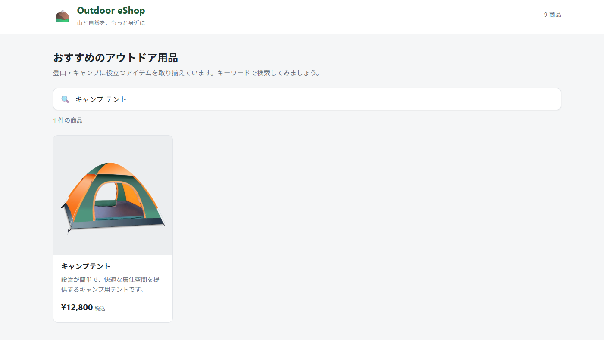

# Lab 04: Cloud Agent の実装内容を確認する

**テーマ:** Cloud Agent が実装したコードをローカルで確認する。

## シナリオ

Cloud Agent が検索バグの修正 PR を作成した。マージをする前に実際の動作と Issue の受け入れ条件をローカルで確認する。
コードの品質担保は Cloud Agent や CI が保証し、人が要件通りの仕様となっているかを判断する。

## 前提条件

- Lab 03 の Issue に対して Cloud Agent が PR を作成していること。

## 手順

### 1. 作成された PR の内容を確認する

GitHub Copilot App の **[My work]** を開き、Lab 03 の作業で作成された PR を開く。
作業済み PR の内容を確認する。

**確認する観点:**
- 半角・全角スペース区切りの複数キーワードが AND で扱われる。
- 連続・前後スペースを無視する。
- 空検索・単一キーワードの既存動作が維持されている。
- `src/lib/search.test.ts` に再現ケースと回帰テストがある。
- 依存追加や lockfile の不整合がない（ガードレールが Cloud Agent にも効いている）。

### 2. ローカルで実際の動作を確認する

1. PR 画面の右上にある **New session** からセッションを開く。

   > [!Tip]
   > このセッションは Lab 03 で Cloud Agent が実装・コミットしたブランチを使用してワークツリーを作成している。
2. このセッションでは Setup スクリプトが起動しないため、Terminal で `npm ci` を実行する。
3. 右上の **Run** を実行する。
4. **動作確認** : アプリケーションが立ち上がったら、検索ボックスに `キャンプ テント`（半角スペース）と入力し、1 件表示されることを確認する。
   

5. 受け入れ条件が満たされていることを確認する。
   - [ ] 半角・全角スペース区切りの複数キーワードを AND 条件で扱う
   - [ ] 連続スペースと前後スペースを無視する
   - [ ] 空検索・単一キーワードの既存動作を維持する
   - [ ] 元の商品配列を変更しない
   - [ ] src/lib/search.test.ts に再現ケースと回帰テストを追加する

### 3. Agent merge を使用して main にマージする

1. 右上の **Draft** を開き、Agent merge を実行する。
2. **Merge pull request** で main へマージする。

## 本ラボで期待する結果

- Cloud Agent がコミットしたブランチでワークツリーセッションが開ける。
- ローカルでアプリケーションが起動し、複数キーワードを含んだ検索が動作する。
- 依頼した受け入れ条件を満たしている。

## Todo

- バックエンド、外部依存の追加
- Playwright を使用した E2E テスト
- マルチモデル (Rubber Duck) レビュー
- IaC、クラウドの利活用
- Automation 機能を活用した定常業務の効率化

---

← [Lab 03](./03-delegate-bug-to-cloud-agent.md) ・ [ラボ目次に戻る](./README.md)
